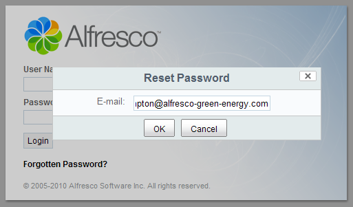

Reset Password Dialogue for Alfresco Share
==========================================

Author: Will Abson

This project provides a customised login page for Alfresco Share, including a password reset dialog that can be used to recover a lost password.

When presented with the dialog, the user can enter their e-mail address to be sent a message containing a new password and a reminder of their username, similar to the following.

    Hello Will,
    
    You requested your password for your account to be reset. You can now log in to Alfresco with the following details.

    Username: willabson
    Password (please change after first login): UI6F1Cgm

    If you did not request your password to be reset, you can normally ignore this email.

    Regards,
    Administrator

The add-on will work with Alfresco version 3.4, 4.0 and greater.

Installation
------------

The add-on is packaged as a single JAR file for easy installation into Alfresco.

To install the add-on, simply drop the `reset-password-dialog-<version>.jar` file into the `tomcat/shared/lib` folder within your Alfresco installation, and restart the application server. You might need to create this folder if it does not already exist. Note: If you are running the repository and Share in different containers you will need to install the JAR file in both.

In Alresco 4.2.b and previous versions, the additional function will appear automatically on the login page. In 4.2.c onwards, you must deploy the _Login page Reset Password Dialog_ module in Share's Module Deployment console in order to enable the capabilities.

Building from Source
--------------------

An Ant build script is provided to build a JAR file containing the custom files, which can then be installed into the `tomcat/shared/lib` folder of your Alfresco installation.

To build the JAR file, run Ant from the base project directory.

    ant dist-jar

The command should build a JAR file named `reset-password-dialog-<version>.jar` in the `build/dist` directory within your project, which you can then copy into the `tomcat/shared/lib` folder of your Alfresco installation.

Alternatively, you can use the build script to _hot deploy_ the JAR file directly into a local Tomcat instance for testing. You will need to use the `hotcopy-tomcat-jar task` and set the `tomcat.home` property in Ant.

    ant -Dtomcat.home=C:/Alfresco/tomcat hotcopy-tomcat-jar
    
After you have deployed the JAR file you will need to restart Tomcat to ensure it picks up the changes.

Usage
-----

Click the _Forgotten Password?_ link on the login page. Enter your e-mail address and click *OK* to confirm.

Credits
-------

Thanks to Erik Billerby for the changes to enable the add-on to work with Alfresco 4.2.c onwards.